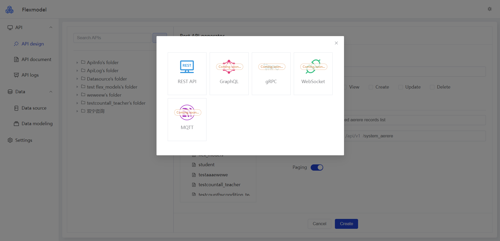
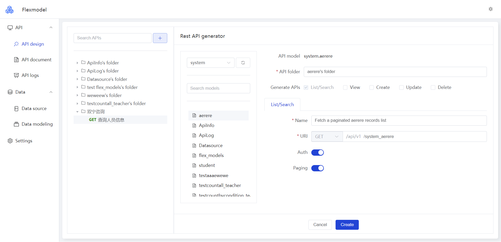
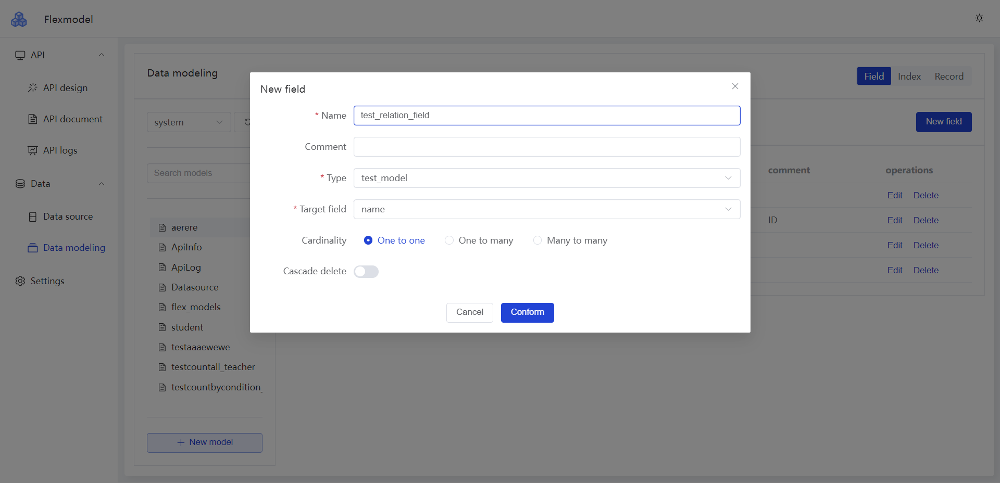

# flexmodel-server

基于 Quarkus + Vert.x 构建的服务端工程，目前已经实现支持关联数据源后在线设计Rest API

## 部署

```cmd
docker run -p 8080:8080 -e JAVA_OPTS="-Dflexmodel.datasource.db-kind=mysql -Dflexmodel.datasource.url=jdbc:mysql://localhost:3306/flexmodel -Dflexmodel.datasource.username=<your username> -Dflexmodel.datasource.password=<your password>" -t cjbi/flexmodel:latest
```

支持的数据库请看引擎部分文档

https://github.com/flexmodel-projects/flexmodel-engine

## 示例





## 在线体验

http://flexmodel.wetech.tech
